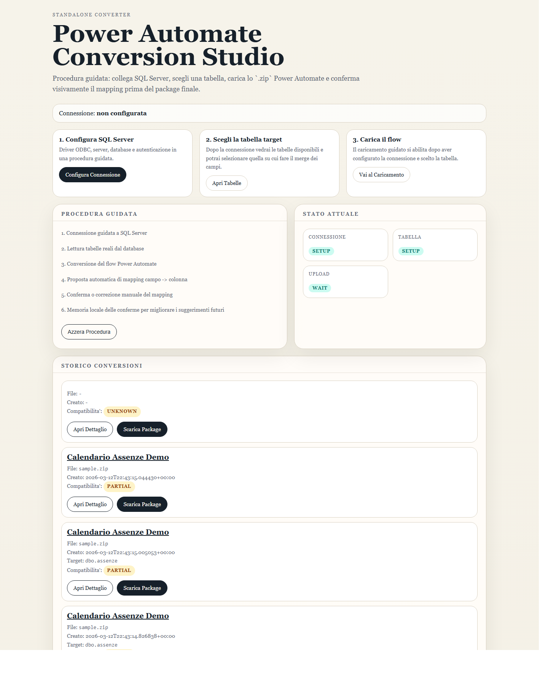
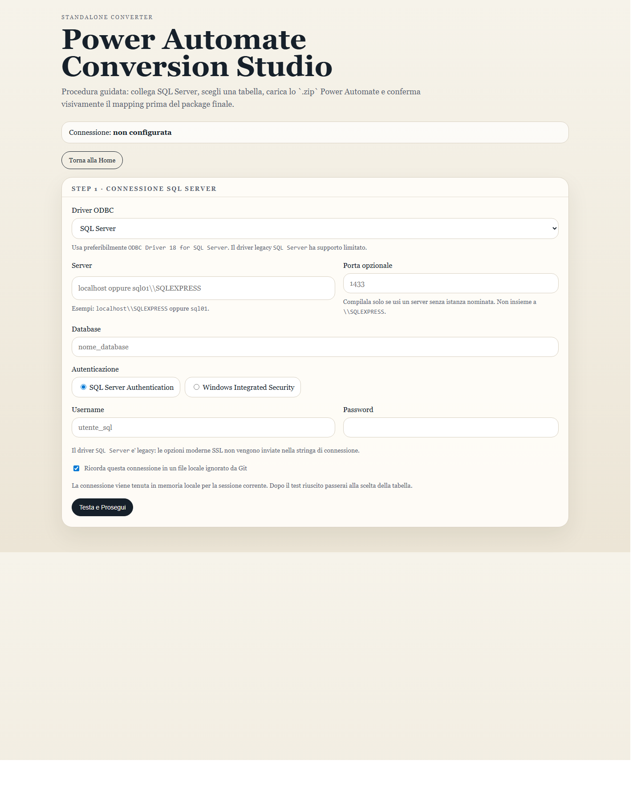
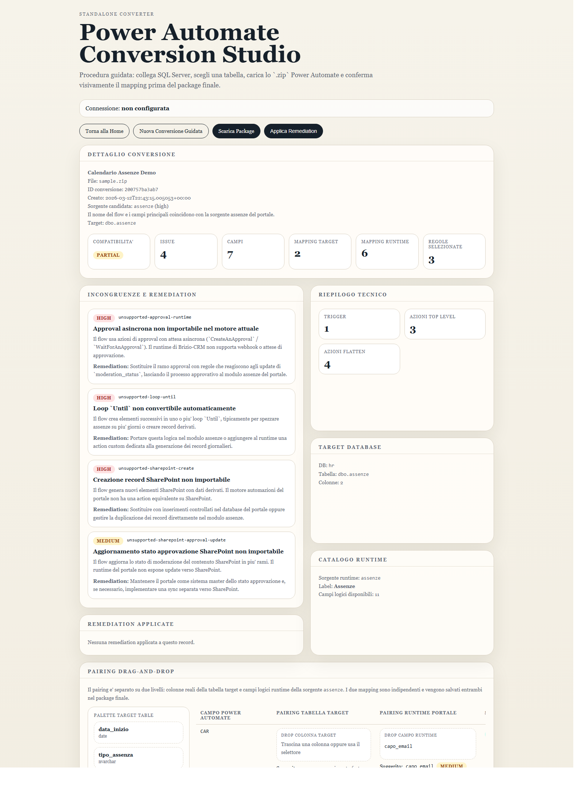

# Power Automate Conversion Studio

<p align="center">
  <strong>Standalone web app per convertire export Power Automate in package strutturati, con targeting SQL Server e mapping visuale confermabile.</strong>
</p>

<p align="center">
  Collega SQL Server, scegli la tabella reale, carica il flow <code>.zip</code> o <code>.json</code>, rivedi il pairing e scarica il package finale.
</p>

> Nota integrazione: oltre alla webapp standalone originale, i servizi di conversione di questa cartella vengono ora riusati direttamente anche nel modulo Django `automazioni` tramite la pagina `Converti Power Automate` in Admin Portale. L'integrazione Django privilegia il catalogo tabelle del portale, il passaggio diretto al workflow `Importa Package` e l'apertura di singole regole importabili nel designer visuale come bozze draft, mentre questa cartella resta la sorgente dei servizi converter e della UI standalone storica.

<p align="center">
  
  
  
  
</p>

---

## Perche esiste

Questo progetto prende un export Power Automate e lo trasforma in un package tecnico piu leggibile e piu vicino al runtime applicativo. Il focus non e solo la conversione: include anche il contesto del database target, una proposta di mapping e una UI per approvare o correggere i suggerimenti prima dell'export finale.

## Cosa fa oggi

- riuso diretto dal modulo Django `automazioni` per analisi, remediation e diagramma flow
- procedura guidata di connessione a `SQL Server`
- lettura reale di tabelle e colonne dal database
- upload di export Power Automate `.zip` e `.json`
- analisi di trigger, azioni, campi usati e connettori
- suggerimento automatico di mapping `campo flow -> colonna target`
- pairing separato tra tabella target e runtime source
- conferma manuale tramite UI e drag-and-drop
- memoria locale dei mapping approvati per migliorare i suggerimenti futuri
- preset portale `novicrom` con catalogo runtime e workflow approval nativo
- storico conversioni con pagina dettaglio, issue e remediation
- download del file finale `automation_package.json`

## Screenshot

> Screenshot reali generati dalla webapp locale di questa repository.

| Home | Wizard SQL Server |
| --- | --- |
|  |  |



## Flusso operativo

1. apri la webapp locale
2. configura driver, server, database e autenticazione SQL Server
3. scegli la tabella target letta dal database
4. carica il flow Power Automate
5. rivedi il mapping suggerito verso tabella e runtime
6. correggi eventuali pairing e seleziona le regole da tenere
7. scarica il package JSON finale

## Guida Al Pairing

La schermata di pairing separa due livelli distinti:

- `Pairing Tabella Target`: collega un campo del flow a una colonna reale del database SQL Server
- `Pairing Runtime Portale`: collega lo stesso campo del flow al nome logico che il portale Django si aspetta a runtime

Questi due mapping sono indipendenti. In pratica:

- una colonna SQL puo avere un nome tecnico diverso dal campo logico usato dal portale
- puoi salvare solo il mapping runtime
- puoi salvare solo il mapping target, ma il package mostrerà un warning esplicito

### Procedura consigliata

1. usa il pannello sinistro per trascinare una colonna SQL nel box `Pairing Tabella Target`
2. trascina poi un campo logico del runtime nel box `Pairing Runtime Portale`
3. controlla lo stato nella riga
4. salva il pairing

### Esempio pratico

Caso tipico:

- campo Power Automate: `EmailDipendente`
- colonna DB target: `request_email`
- campo runtime portale: `dipendente_email`

Nel package finale troverai due blocchi distinti:

```json
{
  "approved_target_field_mapping": {
    "EmailDipendente": {
      "target_field": "request_email",
      "mapping_scope": "target_table"
    }
  },
  "approved_runtime_field_mapping": {
    "EmailDipendente": {
      "target_field": "dipendente_email",
      "mapping_scope": "runtime_source"
    }
  }
}
```

Per un esempio completo, vedi [docs/examples/pairing-example.json](docs/examples/pairing-example.json).

## Profilo Portale E Release Pubblica

Per rendere il tool pubblicabile senza inchiodarlo a un solo cliente, il converter espone un profilo portale esplicito.

Scelta adottata:

- il tool resta pubblico e generico nella struttura
- il comportamento specifico di Novicrom e' dichiarato come preset built-in `novicrom`
- approval e campi runtime non sono hardcoded "a mano" nel builder, ma letti dal catalogo runtime del preset

Questo permette di:

- usare subito il preset `novicrom` per i moduli gia noti (`assenze`, `tasks`, `assets`, `tickets`, `anomalie`)
- introdurre in futuro altri preset o un profilo `generic` senza rompere il formato package

### Approval E Do Until

Nel preset `novicrom`, il modulo `assenze` usa il workflow approvativo nativo del portale:

- stato tecnico: `moderation_status`
- valori: `2 = In attesa`, `0 = Approvato`, `1 = Rifiutato`
- flag di bypass: `salta_approvazione`

Per questo motivo il converter tratta i flow Power Automate cosi':

- `CreateAnApproval` / `WaitForAnApproval`: vengono interpretati come workflow da delegare al portale, non come webhook da ricreare 1:1
- `Do Until` usato solo per attendere l'esito approvativo: va sostituito con regole su `UPDATE` e `moderation_status`
- `Do Until` usato per generare record derivati o spezzare intervalli: resta non convertibile automaticamente e va gestito con logica server-side o action custom

## Avvio rapido

### Requisiti

- Python `3.11+`
- driver ODBC SQL Server installato
- consigliato: `ODBC Driver 18 for SQL Server`

### Setup

```powershell
python -m venv .venv
.venv\Scripts\Activate.ps1
pip install -r requirements.txt
python app\webapp.py
```

La webapp espone di default:

- `http://127.0.0.1:8787`
- `http://0.0.0.0:8787`

Per cambiare host o porta:

```powershell
$env:PA_CONVERTER_HOST="127.0.0.1"
$env:PA_CONVERTER_PORT="8787"
python app\webapp.py
```

## Uso da riga di comando

Se vuoi generare gli artefatti in batch senza passare dalla UI:

```powershell
python app\main.py
```

## Output generati

I file vengono salvati localmente nelle directory sotto `output/`:

```text
output/
|- history/        record completi e package esportati
|- learning/       memoria locale dei mapping confermati
|- normalized/     JSON normalizzati dei flow analizzati
|- packages/       package finali generati
`- previews/       anteprime markdown
```

La memoria locale dei suggerimenti vive in:

```text
output/learning/mapping_memory.json
```

Il profilo locale SQL Server viene salvato in chiaro solo sulla macchina locale:

```text
output/local/sqlserver_profile.ini
```

## Stack e struttura

```text
app/
|- webapp.py                   web UI Flask
|- conversion_service.py       analisi e conversione flow
|- sqlserver_service.py        connessione e introspezione SQL Server
|- build_automation_package.py costruzione package finale
|- runtime_catalog.py          catalogo campi runtime
`- templates/                  interfaccia HTML

tests/
|- test_webapp.py
|- test_conversion_service.py
`- ...
```

## Test

```powershell
python -m unittest discover -s tests
python -m py_compile app\webapp.py app\conversion_service.py app\sqlserver_service.py app\mapping_memory.py
```

## Stato attuale

Il progetto e gia usabile per un flusso guidato locale con SQL Server e conferma manuale del mapping. Non e un motore ML completo: il comportamento "impara" dai mapping approvati salvandoli in locale e riutilizzandoli nelle conversioni successive.
